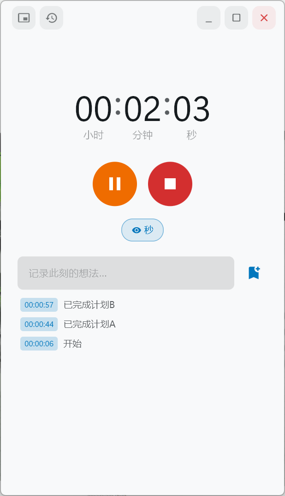
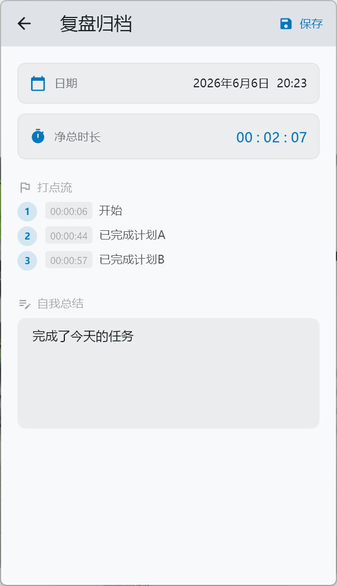
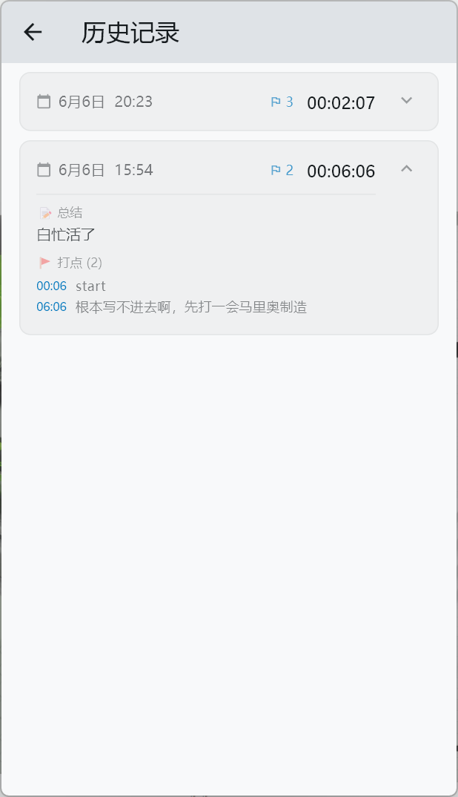

# Stopwatch-Log
结合了随心记+秒表的工具，Flutter 编写，它适合记录专注、练习、工作片段或任何需要“开始计时 - 中途打点 - 结束复盘”的场景。

## 界面预览

<p align="center">
  
  
  
</p>

## 功能

- 计时控制：开始、暂停、继续、结束、重置。
- 时间显示：可切换秒和百分秒显示。
- 打点记录：计时过程中记录关键节点，并可附加备注。
- 复盘归档：结束一次计时后进入复盘页，查看总时长、打点流并填写总结。
- 历史记录：按时间倒序查看过往会话，支持展开摘要、进入详情和左滑删除。
- 悬浮窗：切换到紧凑窗口，便于在桌面其他工作流中持续查看和操作计时。
- 自动保存草稿：计时中关闭或离开应用时保存当前状态，重新打开后尽量恢复进度。
- 本地存储：使用 Drift + SQLite 保存计时会话、打点和当前计时草稿。

## 技术栈

- Flutter / Material 3
- flutter_riverpod：状态管理
- drift + sqlite3_flutter_libs：本地数据库
- window_manager：桌面窗口与悬浮模式
- intl：日期时间格式化
- uuid：会话与打点标识

## 项目结构

```text
lib/
  database/   Drift 表定义、数据库连接和持久化接口
  models/     计时会话与打点模型
  providers/  Riverpod 状态与归档数据源
  screens/    主计时、历史记录、复盘归档页面
  services/   窗口初始化与悬浮窗切换
  theme/      应用字体与主题相关配置
  widgets/    时间显示、控制按钮、打点、悬浮窗等组件
```

## 环境要求

- Flutter SDK
- Dart SDK
- Windows 桌面开发环境

当前项目包含 Windows 桌面配置，并使用 `window_manager` 提供窗口能力。其他平台目录可能存在，但主要体验以 Windows 桌面为准。

## 本地运行

安装依赖：

```bash
flutter pub get
```

运行 Windows 桌面应用：

```bash
flutter run -d windows
```

如果修改了 Drift 数据表或数据库相关代码，重新生成代码：

```bash
dart run build_runner build --delete-conflicting-outputs
```

静态检查：

```bash
dart analyze
```

测试：

```bash
flutter test
```

## 数据存储

应用会在系统应用文档目录中创建本地数据库文件：

```text
C:\Users\<用户名>\Documents\Stopwatch Log\stopwatch_log.db
```

数据库包含：

- `sessions`：一次完整计时会话的日期、总时长和总结。
- `points`：会话中的打点时间和备注。
- `current_timer_state`：未结束计时的草稿状态。

## 开发备注

- 主入口在 `lib/main.dart`。
- 计时逻辑集中在 `lib/providers/timer_provider.dart`。
- 历史归档数据流在 `lib/providers/session_archive_provider.dart`。
- 数据库 schema 在 `lib/database/database.dart`，生成文件为 `lib/database/database.g.dart`。
- 悬浮窗界面在 `lib/widgets/floating_timer.dart`，窗口行为在 `lib/services/window_service.dart`。
